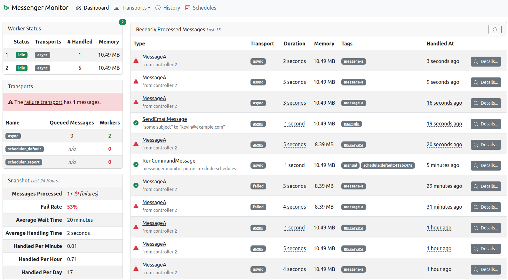

# zenstruck/messenger-monitor-bundle

Batteries included UI to monitor your Messenger workers, transports, schedules, and messages.



If the packaged UI is not to your liking, you can easily build your own with the
[provided tools](#advanced-usage).

## Installation

```bash
composer require zenstruck/messenger-monitor-bundle
```

## `messenger:monitor` Command

With zero configuration, you can run the `messenger:monitor` command to see information
about your running workers and transports. If storage is configured, it displays a
historical snapshot whose period can be customized with the `--period` option.

## Storage

> **Note**: This step is required to use the [User Interface](#user-interface) and [History](#history).

> **Note**: Only Doctrine ORM is currently available as a storage engine.

### Configuration

1. Create a `ProcessedMessage` entity that extends `Zenstruck\Messenger\Monitor\History\Model\ProcessedMessage`
   in your app:
    ```php
    // src/Entity/ProcessedMessage.php

    namespace App\Entity;

    use Zenstruck\Messenger\Monitor\History\Model\ProcessedMessage as BaseProcessedMessage;
    use Doctrine\ORM\Mapping as ORM;

    #[ORM\Entity(readOnly: true)]
    #[ORM\Table('processed_messages')]
    class ProcessedMessage extends BaseProcessedMessage
    {
        #[ORM\Id]
        #[ORM\GeneratedValue]
        #[ORM\Column]
        private ?int $id = null;

        public function id(): ?int
        {
            return $this->id;
        }
    }
    ```
2. Create and execute the migration:
    ```bash
    bin/console doctrine:migrations:diff
    bin/console doctrine:migrations:migrate
    ```
3. Add the entity class to the bundle config:
    ```yaml
    # config/packages/zenstruck_messenger_monitor.yaml

    zenstruck_messenger_monitor:
        storage:
            orm:
                entity_class: App\Entity\ProcessedMessage
    ```

### Usage

Once configured, consumed messages are tracked and saved. These _processed messages_
contain a lot of useful information and can be viewed in the [user interface](#user-interface).

#### Disable Monitoring

You may want to disable monitoring for certain messages. There are two ways to do this:

1. When dispatching the message, add the `DisableMonitoringStamp`:
    ```php
    use Zenstruck\Messenger\Monitor\Stamp\DisableMonitoringStamp;

    /** @var \Symfony\Component\Messenger\MessageBusInterface $bus */

    $bus->dispatch(new MyMessage(), [new DisableMonitoringStamp()])
    ```
2. Add the `DisableMonitoringStamp` as a class attribute to your message:
    ```php
    use Zenstruck\Messenger\Monitor\Stamp\DisableMonitoringStamp;

    #[DisableMonitoringStamp]
    class MyMessage
    {
    }
    ```

#### Description

The stored `ProcessedMessage` has a description property. This is helpful to differentiate between
messages in the user interface. By default, this is the _stringified_ version of the message object
(if it implements `\Stringable`). You can add the `DescriptionStamp` to customize:

```php
use Zenstruck\Messenger\Monitor\Stamp\DescriptionStamp;

/** @var \Symfony\Component\Messenger\MessageBusInterface $bus */

$bus->dispatch(new MyMessage(), [new DescriptionStamp('some custom description')])
```

#### Tags

To help with filtering processed messages, they can have one or more _tags_. Some tags
are added automatically (like `schedule` if it's a scheduled message) but you can also
add your own in one of two ways:

1. When dispatching the message, add one or more `TagStamp`'s:
    ```php
    use Zenstruck\Messenger\Monitor\Stamp\TagStamp;

    /** @var \Symfony\Component\Messenger\MessageBusInterface $bus */

    $bus->dispatch(new MyMessage(), [new TagStamp('tag-1'), new TagStamp('tag-2')])
    ```
2. Add the `DisableMonitoringStamp` as a class attribute to your message:
    ```php
    use Zenstruck\Messenger\Monitor\Stamp\TagStamp;

    #[TagStamp('tag-1')]
    #[TagStamp('tag-2')]
    class MyMessage
    {
    }
    ```

#### `messenger:monitor:purge` Command

If your app handles a lot of messages, the processed message database table will get very large.
The `messenger:monitor:purge` clears messages older than a specific date:

```bash
bin/console messenger:monitor:purge # by default, purges all messages older than 1 month

bin/console messenger:monitor:purge --older-than 1-day
bin/console messenger:monitor:purge --older-than 1-week

bin/console messenger:monitor:purge --exclude-schedules # ignore messages tagged with "schedule"
```

> **Note**: If using `symfony/schedule`, you might want to keep a specific # of these messages
> as they might only run once a month or year.

> **Tip**: Schedule this command to run daily with `symfony/schedule` and
> [`RunCommandMessage`](https://symfony.com/doc/6.4/messenger.html#trigger-a-command).

#### `messenger:monitor:schedule:purge` Command

If using `symfony/schedule`, you might want to keep a specific # of these messages as they might run
very infrequently. When running `messenger:monitor:purge`, add the `--exclude-schedules` option to
avoid deleting schedule history. Then run `messenger:monitor:schedule:purge` keep a specific number
(10 by default) of _task run histories_.

```bash
bin/console messenger:monitor:schedule:purge # by default, keeps 10 runs for each task

bin/console messenger:monitor:schedule:purge --keep 5 # keep only 5
```

Use the `--remove-orphans` option to delete schedule task runs that are no longer associated with a schedule.

```bash
bin/console messenger:monitor:schedule:purge --remove-orphans
```

> **Tip**: Schedule this command to run daily with `symfony/schedule` and
> [`RunCommandMessage`](https://symfony.com/doc/6.4/messenger.html#trigger-a-command).

## User Interface

> **Note**: [Storage](#storage) must be configured for this feature.

Create a controller that extends `Zenstruck\Messenger\Monitor\Controller\MessengerMonitorController`
in your app:

```php
// src/Controller/MessengerMonitorController.php

namespace App\Controller;

use Symfony\Component\Routing\Annotation\Route;
use Symfony\Component\Security\Http\Attribute\IsGranted;
use Zenstruck\Messenger\Monitor\Controller\MessengerMonitorController as BaseMessengerMonitorController;

#[Route('/admin/messenger')] // path prefix for the controllers
#[IsGranted('ROLE_ADMIN')] // alternatively, use a firewall
final class MessengerMonitorController extends BaseMessengerMonitorController
{
}
```

You can now access the dashboard at: `/admin/messenger` or with the route `zenstruck_messenger_monitor_dashboard`.

> **Warning**: It is important that your `MessengerMonitorController` is only accessible by
> site administrators as it contains sensitive application information. Use either the
> `IsGranted` attribute on your controller as shown above and/or ensure the controller is
> behind an [access-controlled firewall](https://symfony.com/doc/current/security.html#securing-url-patterns-access-control)
> that only allows site administrators.

> **Tip**: Install `knplabs/knp-time-bundle` (`composer require knplabs/knp-time-bundle`) to display
> friendlier times and durations in the UI.

## Advanced Usage

### `Workers` Service

#### `WorkerInfo`

### `Transports` Service

#### `TransportInfo`

#### `QueuedMessage`

### `Schedules` Service

#### `ScheduleInfo`

#### `TaskInfo`

#### `MessageInfo`

#### `TriggerInfo`

### History

> **Note**: [Storage](#storage) must be configured for this feature.

#### `Storage` Service

#### `Specification`

#### `Snapshot`

## Full Default Bundle Configuration

```yaml
zenstruck_messenger_monitor:
    live_components:
        enabled:              false

        # Role required to view live components.
        role:                 ROLE_MESSENGER_MONITOR
    storage:
        orm:

            # Your Doctrine entity class that extends "Zenstruck\Messenger\Monitor\History\Model\ProcessedMessage"
            entity_class:         ~
```
